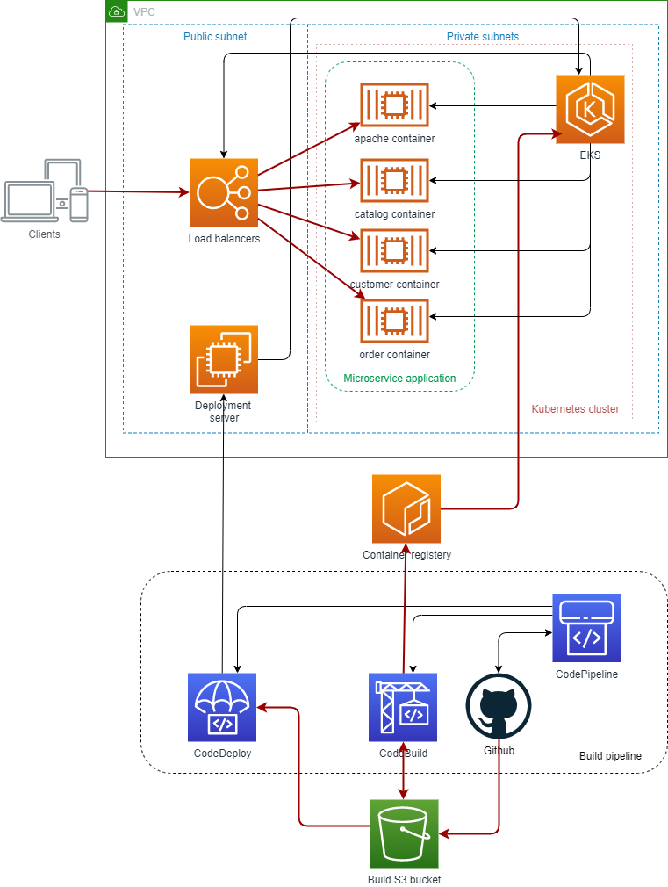
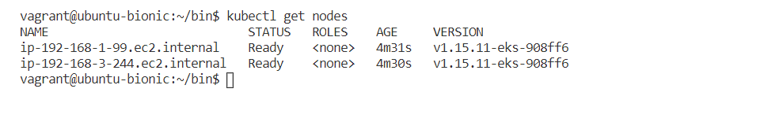
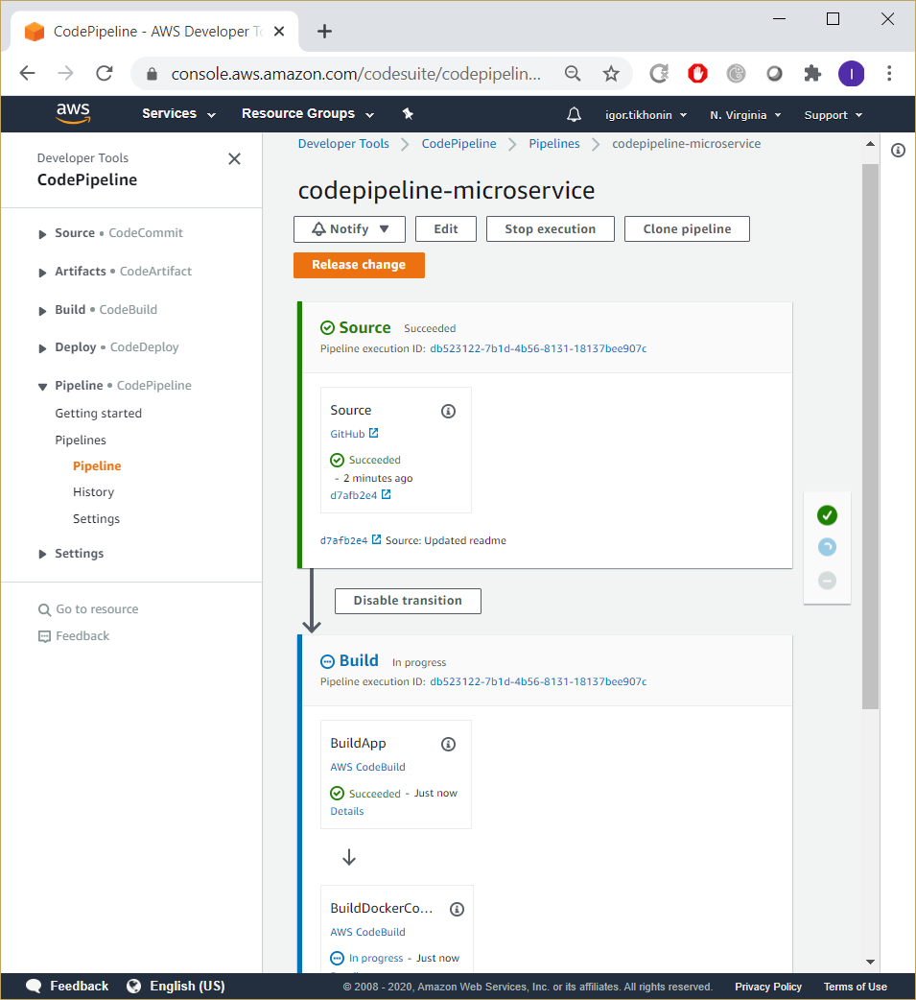
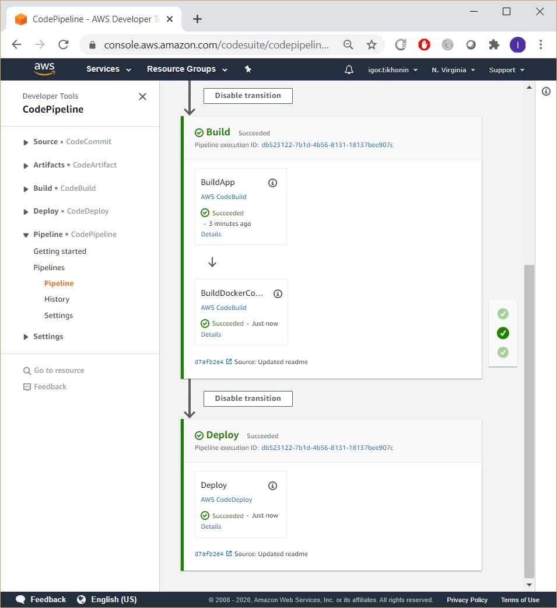
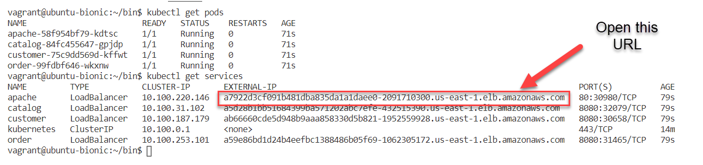
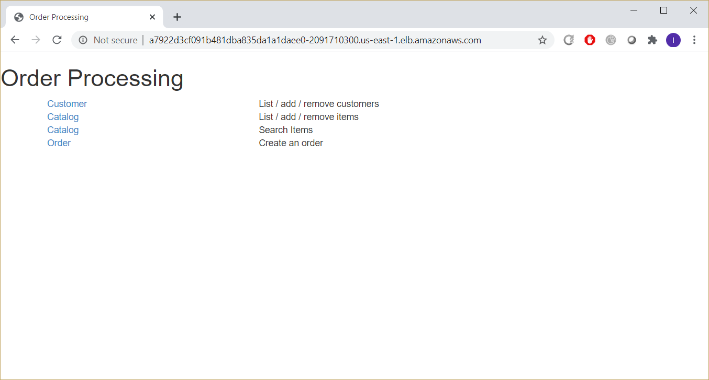

# Deployment of a Microservice Application to Kubernetes

This repo contains Ansible code of a fully automated deployment of a microservice application to Kubernetes. The application is taken from the Eberhard Wolff's [Microservices Book](https://github.com/ewolff/microservice-kubernetes). Amazon Elastic Kubernetes Service is used as a deployment target. AWS CodePipeline builds the application from source code, creates Docker images, and deploys containers to EKS.

## Description
The Ansible playbook:
* creates a VPC, which consists of one public and two private subnets,
* deploys an internet gateway for the public subnet, and a NAT gateway for the private subnets,
* builds an EKS cluster and two worker nodes; the worker nodes are built in the private subnets,
* creates an AWS CodePipeline, AWS CodeBuild projects, and AWS CodeDeploy application and deployment group,
* builds a Linux deployment server in the public subnet for CodeDeploy to run deployments to EKS,
* AWS CodePipeline, once created, builds the application, creates container images and stores them to Amazon Elastic Container Registry,
* repositories for contaner images are created automatically as needed,
* when container images are ready, AWS CodeDeploy runs deployment to EKS via the Linux deployment server, using a YAML deployment manifest
## Architectural diagram

## How to run
1. Create your own copy of this Github repo: https://docs.github.com/en/github/creating-cloning-and-archiving-repositories/duplicating-a-repository
2. Generate Github access token: https://docs.github.com/en/github/authenticating-to-github/creating-a-personal-access-token (select repo)
3. Obtain your AWS Access key and Secret key: https://docs.aws.amazon.com/general/latest/gr/aws-sec-cred-types.html (see Programmatic access section)
4. Create an AWS SSH key pair: https://docs.aws.amazon.com/AWSEC2/latest/UserGuide/ec2-key-pairs.html#prepare-key-pair (choose pem)
5. Log on your Linux machine and run the Ansible playbook (the following code works on Ubuntu):

```bash
# Define variables
export GITHUB_REPO_URL="your_github_repo, e.g. https://github.com/ivtikhon/microservice-kubernetes.git"
export AWS_ACCESS_KEY_ID="your_aws_access_key"
export AWS_SECRET_ACCESS_KEY="your_aws_secret_key"
export AWS_DEFAULT_REGION="aws_region_of_your_choice, e.g. us-east-1"
export GITHUB_ACCESS_TOKEN="your_github_access_token"
export SSH_PRIVATE_KEY_PATH="path_to_your_private_ssh_key_file, e.g. ~/.ssh/linux_key.pem"
export SSH_KEY_NAME="name_of_your_aws_ssh_key_pair, e.g. linux_key"
# Install Ansible
sudo apt-get update
sudo apt-get install -y software-properties-common python-pip apt-utils
sudo apt-add-repository --yes --update ppa:ansible/ansible
sudo apt-get install -y ansible
pip install boto boto3 awscli
# Clone git repository (skip this step if you already have a local copy of the repo)
git clone ${GITHUB_REPO_URL}
cd $(echo "${GITHUB_REPO_URL##*/}" | sed 's/.git$//')
# Run Ansible playbook
ansible-playbook -vv -i 'localhost ansible_connection=local,' --extra-vars="git_repo_path='${GITHUB_REPO_URL}' aws_access_key='${AWS_ACCESS_KEY_ID}' aws_secret_key='${AWS_SECRET_ACCESS_KEY}' git_token='${GITHUB_ACCESS_TOKEN}' ssh_private_key_path='${SSH_PRIVATE_KEY_PATH}' ssh_key_name='${SSH_KEY_NAME}' aws_region='${AWS_DEFAULT_REGION}'" infra/ansible/infra.yml
```
5. When the playbook finishes (in about 30 min), check that the EKS nodes are accessible (the EKS cluster name is dev_eks):
```bash
# Create bin directory (skip this step if you already have this directory)
mkdir ~/bin
cd ~/bin
export PATH=$PATH:${HOME}/bin
# Obtain kube config and kubectl binary
aws eks update-kubeconfig --name dev_eks --region us-east-1
curl -o kubectl https://amazon-eks.s3.us-west-2.amazonaws.com/1.15.11/2020-07-08/bin/linux/amd64/kubectl
chmod 755 kubectl
curl -o aws-iam-authenticator https://amazon-eks.s3.us-west-2.amazonaws.com/1.15.11/2020-07-08/bin/linux/amd64/aws-iam-authenticator
chmod 755 aws-iam-authenticator
# Check cluster nodes
kubectl get nodes
```
  
The output should look like this:



6. Log on the AWS Console and check status of the AWS CodePipeline (the pipeline name is codepipeline-microservice)  

Build stage:  

  
Deploy stage:  


7. When the pipeline finishes, check that the Microservice application is deployed to EKS
```bash
kubectl get pods
kubectl get services
```
The output should look like this:


8. Open the application URL (apache external-ip):  


