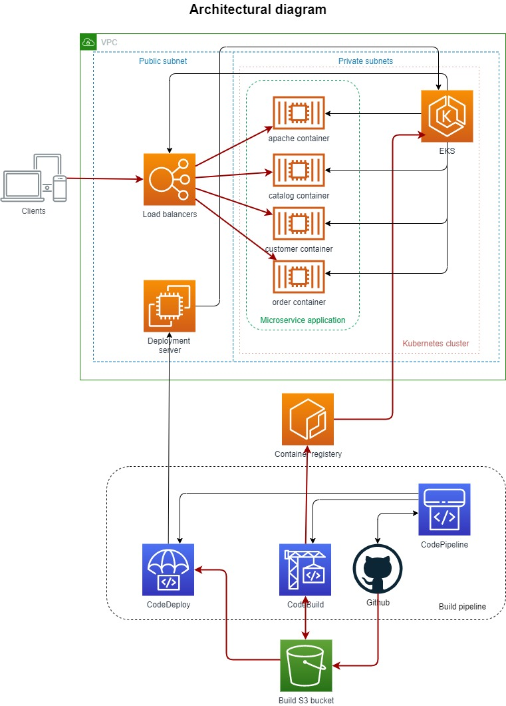

# Deployment of a Microservice Application to Kubernetes

This repo contains Ansible code of a fully automated deployment of a microservice application to Kubernetes. The application is taken from the Eberhard Wolff's [Microservices Book](https://github.com/ewolff/microservice-kubernetes). Amazon Elastic Kubernetes Service is used as a deployment target. AWS CodePipeline builds the application from source code, creates Docker images, and deploys containers to EKS.

## Description
The Ansible playbook:
* creates a VPC, which consists of one public and two private subnets,
* deploys an internet gateway for the public subnet, and a NAT gateway for the private subnets,
* builds an EKS cluster and two worker nodes; the worker nodes are located in the private subnets,
* creates an AWS CodePipeline, AWS CodeBuild projects, and AWS CodeDeploy application and deployment group,
* builds a Linux deployment server in the public subnet for CodeDeploy to run deployments to EKS,
* AWS CodePipeline, once created, builds the application, creates container images and stores them to Amazon Elastic Container Registry,
* repositories for contaner images are created automatically as needed,
* when container images are ready, AWS CodeDeploy runs deployment to EKS via the Linux deployment server, using a YAML deployment manifest
## Architectural diagram

## How to run
```
git clone https://github.com/ivtikhon/microservice-kubernetes.git
apt-get update
apt-get install -y software-properties-common python-pip apt-utils
apt-add-repository --yes --update ppa:ansible/ansible
apt-get install -y ansible
pip install boto boto3 awscli
cd microservice-kubernetes

ansible-playbook -vv -i 'localhost ansible_connection=local,' --extra-vars="git_repo_path='https://github.com/ivtikhon/microservice-kubernetes.git' aws_access_key='_ACCESS_KEY_' aws_secret_key='_SECRET_KEY_' git_token='_GIT_TOKEN_' ssh_private_key_path='_SSH_KEY_PATH_' ssh_key_name='_SSH_KEY_NAME_'" infra/ansible/infra.yml
```